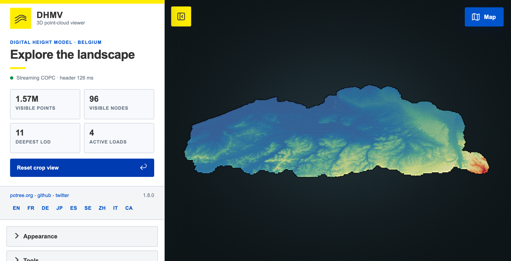
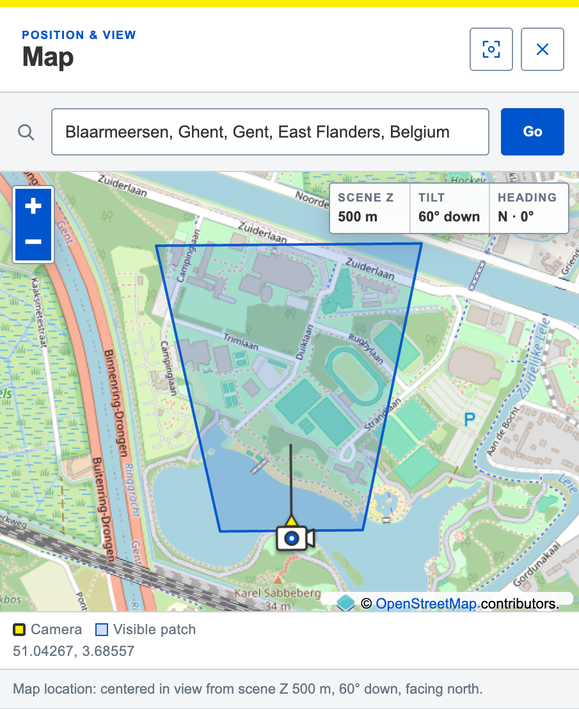
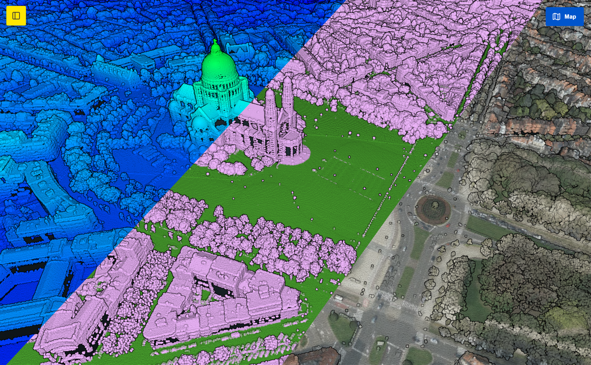
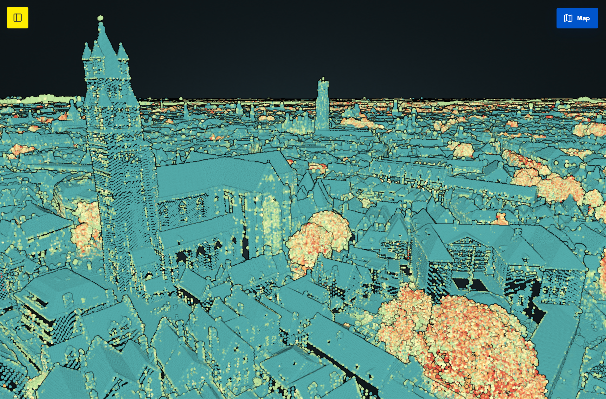

<div align="center">

# 🇧🇪 Flanders in Points

### Every LiDAR point of Flanders, streaming in your browser. No install, no download, no desktop GIS.

**~3.3 TB** of DHMV II LiDAR · **one** file · **zero** tiles to manage

[](LICENSE)
[](https://copc.io/)
[](https://remotesensing.vlaanderen.be/apps/openlidar/)
[](https://flol3622.github.io/DHMVII_potree-next/)

### [▶ Open the live test viewer](https://flol3622.github.io/DHMVII_potree-next/)

<!-- 📸 SCREENSHOT: hero shot. Oblique view over a city (Ghent/Antwerp), elevation colouring, map panel visible in the corner. Wide crop, ~1600px. -->


</div>

## 🌍 What is this?

The Netherlands has had [**ahn2.pointclouds.nl**](http://ahn2.pointclouds.nl/) since 2015 — a web page where anyone can fly through 640 billion LiDAR points of an entire country. No login, no software, no GIS degree. It is still one of the nicest pieces of open-data outreach in the field. 🇳🇱

Flanders has an equally good national LiDAR survey — **DHMV II**, flown 2013–2015 at ≥ 8 points/m² — and it is genuinely open data. It just has no front door. You can download tiles. You cannot *look* at it. 🤷

This repository is the result of a research project asking a simple question: **what would the Flemish version look like, and what does it actually take to build one in 2026?**

Turns out: a lot less than in 2015. 🎉

The whole thing is **one file**, streamed straight from a plain web server. No tile pyramid on disk, no database, no tiling service, no backend. The browser asks for the ~2 MB of that 3.3 TB file it needs for your current view, and nothing else.

> 🎓 **On scope.** This is a *transformation* project, not a new dataset. Every point here is public DHMV II data, re-encoded into a format a browser can read. The research contribution is the pipeline and the demonstration — not the survey, which the Flemish government paid for and released.

## ✨ What it does

|  | |
| :-- | :-- |
| 🛰️ | **Streams all of Flanders** — HTTP range requests into a single COPC file. The file is never copied, never unpacked. |
| 🗺️ | **Navigation map** — an OpenStreetMap panel showing exactly where you are, where you're looking, and roughly how much ground you can see. Click it to fly there. |
| 🔎 | **Address search** — type a street or a town, land on it. Belgian Lambert 72 handled behind the scenes. |
| 🌈 | **Elevation, intensity, classification, RGB** — the full Potree material palette, plus eye-dome lighting so the surface actually reads as a surface. |
| 📏 | **Measure things** — distances, areas, heights, profiles. Potree's standard toolkit, kept intact. |
| 📊 | **Live streaming stats** — visible points, visible nodes, octree depth, in-flight requests. Useful when you want to see *why* it feels fast. |
| 🗣️ | **Four languages** — English, French, Dutch, German. The Dutch translation is new here; Potree didn't ship one, which is a strange gap for a Flemish dataset. |

<!-- 📸 SCREENSHOT: the map panel, zoomed in, with the view-footprint patch and the heading arrow clearly visible. Crop tight, ~800px. -->


<!-- 📸 SCREENSHOT: side-by-side or single shot of elevation colouring vs. classification colouring on the same scene. -->


## 🚦 Status & roadmap

**Where things stand right now:**

| | |
| :-- | :-- |
| ✅ | **The full-Flanders COPC exists.** 3.3 TB, built, verified, sitting on HPC storage. |
| ⏳ | **Hosting is the blocker.** Serving 3.3 TB with byte-range support is an infrastructure question, not a code question. Conversations ongoing. |
| ✅ | **A small test COPC powers the [GitHub Pages viewer](https://flol3622.github.io/DHMVII_potree-next/)** from the separate `gh-pages` branch. |
| ✅ | **Navigation map + address search** — added so people who aren't point-cloud people can still find their own house. |

**Next up:**

| | |
| :-- | :-- |
| 🌐 | Public hosting of the full cloud, once storage lands. |
| 🧭 | Deep links (`?x=…&y=…&z=…`) so a view can be shared or cited. |

> 💡 Got hosting capacity for a 3.3 TB range-request-friendly bucket? That is currently the single thing standing between this repo and a public Flemish AHN2. Get in touch.

## 🧩 How it works

Three moving parts, and only the third one is this repository's own code.

```
   DHMV II open LiDAR                 copc_converter                    this viewer
   42 tar archives                    (Rust, out-of-core)               (browser)
   100k+ LAZ tiles      ──────►       21.5 h on HPC        ──────►      HTTP Range
   ~3.3 TB                            one COPC file                     ~2 MB/view
```

### 1️⃣ The data — DHMV II

The Flemish government's second national LiDAR survey, flown 2013–2015, ≥ 8 points/m² per strip with ≥ 50 % strip overlap, published as open data through [OpenLidar](https://remotesensing.vlaanderen.be/apps/openlidar/). Downloaded at **Ghent University's HPC** because the download alone is measured in terabytes.

### 2️⃣ The format — COPC 🗜️

[**COPC**](https://copc.io/) (Cloud Optimized Point Cloud) is the quiet hero here. It is *just a LAZ 1.4 file* — but the points inside are laid out as a clustered octree, with the hierarchy stored in a VLR. That one change means a client can read a header, read a hierarchy page, and then request exactly the byte ranges for the nodes in view.

The consequence is the whole reason this project is small: **no tiling step, no derived pyramid, no special server.** Any web server that speaks HTTP range requests is a point cloud server. This is COG's trick, applied to LiDAR.

### 3️⃣ The conversion — `copc_converter` ⚙️

Turning hundreds of thousands of inconsistent LAZ tiles into one coherent octree is the hard part, and it is solved by [**360-geo/copc-converter**](https://github.com/360-geo/copc-converter) — an external-memory Rust converter that merges and indexes far more data than fits in RAM. Without it, this project does not exist.

The real run: **21.5 hours**, 372 core-hours, peak RSS 26 GiB, and a *lot* of spill storage. Full numbers, phase-by-phase profiling, and the "we requested 300 GB of memory and used 26" post-mortem live in [`pipeline/README.md`](pipeline/README.md), along with the scripts themselves. The awkward part — every source tile carrying a *slightly* different CRS record, which the merger rejects byte-for-byte — got its own solution: a stamper that appends a normalised WKT EVLR without ever decoding the compressed points.

### 4️⃣ The viewer 👁️

A heavily condensed and re-skinned build of [**m-schuetz/Potree-Next**](https://github.com/m-schuetz/Potree-Next), Markus Schütz's rewrite of Potree — **the piece that made COPC usable inside Potree at all.**

What lives here is not a fork in the git sense. The upstream tree was reduced to the runtime a single deployment needs, and the history did not survive the import (so the exact upstream commit is, honestly, not recorded — see [Provenance](#-provenance-the-honest-version)). On top of that sits a small application layer: DHMV crop and camera, the status panel, the map, a Vite build, and dev middleware that serves the local COPC with proper `206 Partial Content` responses.

## 🚀 Try it

The [GitHub Pages viewer](https://flol3622.github.io/DHMVII_potree-next/) runs against a small test COPC. The `gh-pages` branch contains that test deployment and frames the camera around its 500 × 500 m footprint.

To run the full-cloud branch locally, you need **Node.js** `^20.19.0` or `>=22.12.0`, npm, and access to the full COPC:

```bash
mkdir -p pointclouds
ln -s /path/to/rawpoints_flat_BE.copc.laz pointclouds/rawpoints_flat_BE.copc.laz
npm install && npm run dev
```

Open <http://localhost:5173> and you're flying. 🛫

You can also point at a remote range-enabled host via `.env`:

```dotenv
VITE_POINT_CLOUD_URL=https://data.example.org/rawpoints_flat_BE.copc.laz
```

The host must support `GET`, `HEAD`, and single byte ranges. Cross-origin? It also needs to allow the `Range` request header and expose `Accept-Ranges`, `Content-Length`, and `Content-Range` through CORS.

The full dataset is represented on `main` only by a symlink; it never enters the bundle or repository history.

<details>
<summary>📦 <b>Building the static site</b></summary>

```bash
npm run build && npm run preview
```

Output lands in `dist/`, and that directory is the entire website. The point cloud is hosted separately (or mounted by the web server at `pointclouds/…` relative to `index.html`).

`VITE_BASE_PATH=./` keeps the bundle portable between a domain root and a subdirectory; set something like `/flanders-points/` if your platform insists. See [.env.example](.env.example).

</details>

<details>
<summary>🛠️ <b>Re-running the HPC pipeline</b></summary>

```bash
export WORK=/path/to/scratch/DHMV_2
export BIG_STORAGE=/path/to/high-quota/DHMV_2
cd "$WORK/pipeline" && qsub 00_download.sh
```

Needs `aria2c`, `tar`, [`uv`](https://docs.astral.sh/uv/), and `copc_converter` on `PATH`. Written for PBS/Torque, but every path comes from [`config.sh`](pipeline/config.sh) and the `#PBS` directives are inert comments elsewhere. Budget your `--temp-dir` for the *peak*, not the average — and watch inodes, not just bytes. 📉

</details>

## 🗂️ Repository layout

```text
.
├── index.html          # Vite entry point
├── src/                # the DHMV-specific layer — main.js, map.js, config.js, styles
├── pipeline/           # HPC scripts that turned 42 tar archives into one COPC
├── public/vendor/      # retained Potree runtime + browser libraries
├── pointclouds/        # full-cloud symlink on main; test COPC on gh-pages
├── docs/screenshots/   # images used by this README
└── vite.config.js      # static build + local Range middleware
```

> ⚠️ Potree resolves its workers, GUI fragments, translations, icons, and textures *relative to `potree.js` at runtime*. Keep the structure inside `public/vendor/potree/` intact.

## 🙏 Credits

This project is mostly other people's excellent work, glued together with intent. In rough order of "how badly would this break without you":

| Who | What | Licence |
| :-- | :-- | :-- |
| 🏛️ **[Digitaal Vlaanderen](https://remotesensing.vlaanderen.be/apps/openlidar/)** | The DHMV II survey itself — flown, processed, and *released openly*. None of this is possible with closed data. | Open data, attribution required |
| 📐 **[Hobu, Inc.](https://copc.io/)** — Andrew Bell, Howard Butler, Connor Manning | The COPC specification. One file, no tiling, no server. The idea this project rests on. | Open specification |
| 🦀 **[360-geo/copc-converter](https://github.com/360-geo/copc-converter)** | The out-of-core Rust converter that merged the whole tile collection into one octree. Nothing else we tried could do it at this scale. | MIT |
| 🌲 **[Markus Schütz](https://github.com/m-schuetz/Potree-Next)** | Potree and Potree-Next — over a decade of making massive point clouds render in a browser, and the COPC support this viewer is built on. | AGPL-3.0 |
| 🇳🇱 **[NLeSC / TU Delft](https://github.com/NLeSC/ahn-pointcloud-viewer)** | ahn2.pointclouds.nl, the thing we're trying to match. Proof that this is worth doing. | — |
| 🎓 **[Ghent University HPC](https://www.ugent.be/hpc/en)** | Compute, storage, and patience for a 21.5-hour job. | — |

Also quietly essential: 🗺️ **OpenStreetMap** contributors (base map, ODbL), 🔍 **Photon**/Komoot (geocoding), and the browser libraries under `public/vendor/libs/` — OpenLayers, proj4js, jQuery, jQuery UI, jsTree, d3, spectrum, tween.js, i18next, copc.js.

## 🎓 Funding & acknowledgements

<a href="https://www.ugent.be/en"></a>

**This work has been (partially) funded by the Flanders AI Research program.**

Carried out at **Ghent University**, whose HPC infrastructure provided the compute
and storage the conversion needed — a 21.5-hour job across a multi-terabyte
collection is not something you run on a laptop.

<br clear="left">

## ⚖️ Licence

Short version: **the code is [AGPL-3.0-only](LICENSE). The data is not ours to license.** Those are two separate questions and it matters that they stay separate.

### The code 🔒

This viewer is a derivative of Potree-Next, which is **AGPL-3.0** (Copyright 2021 Markus Schütz). AGPL is *strong copyleft*, so this was never a menu we got to pick from — a derivative of AGPL software is AGPL software. The root [LICENSE](LICENSE) is carried over from upstream unchanged, and `package.json` declares the SPDX identifier `AGPL-3.0-only`.

The part worth understanding is **AGPL § 13**, the clause that separates AGPL from plain GPL:

> If you run a modified version on a server and let users interact with it **over a network**, you must offer those users the source of your modified version.

For a normal library that clause rarely fires. For a *web viewer* it fires every single time someone loads the page. Deploying this publicly is exactly the trigger — which is why this repository is public, and why any fork that goes online must publish its source too. Schütz [chose AGPL deliberately](LICENSE) to close the SaaS loophole; that choice propagates here, and we think it's the right one for a publicly funded dataset anyway. 👍

Everything in this repository that is *not* under `public/vendor/` — the DHMV integration layer in [`src/`](src/) and the HPC scripts in [`pipeline/`](pipeline/) — is original work released under the same AGPL-3.0-only terms.

<details>
<summary>📚 <b>The vendored components (they keep their own licences)</b></summary>

AGPL's copyleft applies to *this* work; it does not retroactively relicense third-party code we merely bundle. Permissive licences combine into an AGPL work fine — the obligation is to preserve their notices, which is why every licence file stays beside its code.

| Component | Licence | Notice |
| :-- | :-- | :-- |
| Classic Potree 1.8 runtime | BSD-2-Clause © 2011–2020 Markus Schütz | `public/vendor/potree/LICENSE` |
| Potree math adapted from three.js | MIT | per-file headers |
| OpenLayers 3 | BSD-2-Clause | `libs/openlayers3/LICENSE` |
| proj4js | MIT-style | `libs/proj4/LICENSE.md` |
| d3 | BSD-3-Clause © Michael Bostock | `libs/d3/LICENSE` |
| jQuery 3.1.1 | MIT © jQuery Foundation | `libs/jquery/LICENSE.txt` |
| jQuery UI | MIT © jQuery Foundation | `libs/jquery-ui/LICENSE.txt` |
| jsTree | MIT © Ivan Bozhanov | `libs/jstree/LICENSE-MIT` |
| spectrum | MIT © Brian Grinstead | `libs/spectrum/LICENSE` |
| tween.js | MIT | `libs/tween/LICENSE.txt` |
| i18next 1.8.0 | MIT © Jan Mühlemann | `libs/i18next/LICENSE` |
| copc.js | MIT © Connor Manning | `libs/copc/LICENSE` + file banner |
| BinaryHeap | MIT © Marijn Haverbeke | header in `libs/other/BinaryHeap.js` |

MIT requires the full permission text to travel with the code, not just a
one-line pointer. Three vendored builds shipped without it — copc.js had no
notice at all, while i18next and jQuery carried only a short banner — so each
now has the verbatim upstream licence beside it, and the minified copc.js
bundle gained a `/*! … */` banner of its own. Each file records which upstream
tag its text came from. ✅

`copc_converter` is **MIT** but is *not* vendored here — it's an external tool the pipeline calls. Credit, no bundling obligation.

</details>

### The data 🗺️

**The AGPL does not cover the point cloud, and cannot.** DHMV II is the Flemish government's data, distributed through `remotesensing.vlaanderen.be` under its own open-data terms — the "Gratis Open Data Licentie Vlaanderen" family, whose core condition is straightforward **attribution to the data owner** on any distribution or publication.

The COPC we produced is a *derived work of that data*, not of this software. So:

- ✅ Use, fly through, screenshot, cite. Attribute **Digitaal Vlaanderen / DHMV II**.
- 📋 Check the current terms at the [source](https://remotesensing.vlaanderen.be/apps/openlidar/) before you redistribute a derived point cloud — licence text and registration requirements change, and the source is the authority, not this README.
- 🗺️ Map tiles are © OpenStreetMap contributors (ODbL); the attribution stays visible in the map panel, please leave it there.

**Suggested attribution** for anything built on this:

> Point cloud: DHMV II, © Digitaal Vlaanderen, open data. Viewer: Flanders in Points, AGPL-3.0, derived from Potree-Next (Markus Schütz). Format: COPC (Hobu, Inc.). Conversion: copc-converter (360-geo).

## 🔍 Provenance

Two things about this repository are worth stating:

**The upstream history is gone.** Potree-Next was imported by reduction, not by fork. The git history and upstream remote did not come along, and no revision file was kept — so the exact upstream commit this started from **is not recorded**.

**The runtime isn't pure Potree-Next.** The surviving bundle pairs the COPC loader with classic Potree 1.8-compatible runtime and GUI assets. That is why the deployed API is `Potree.Viewer`, why the bundle reports version 1.8.0, and why the layout looks nothing like the WebGPU-focused upstream source tree. The *provenance* is Potree-Next; the *composition* is a hybrid.

<div align="center">

<!-- 📸 SCREENSHOT: something beautiful. A cathedral, a harbour crane, a forest canopy — one place that makes the resolution obvious. -->


**3.3 terabytes. One file. A browser tab.** 🎈

*Built at Ghent University on public data, standing on a lot of other people's shoulders.*

</div>
